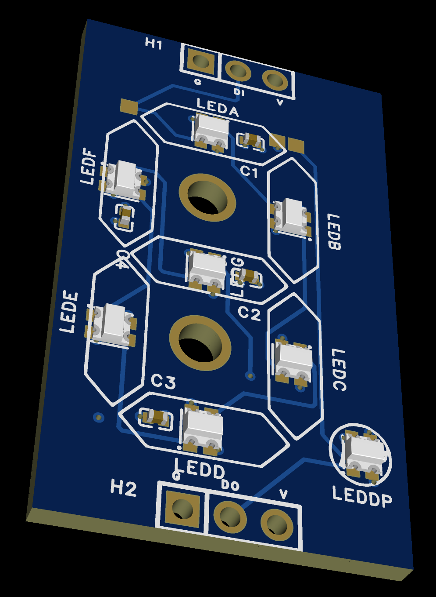
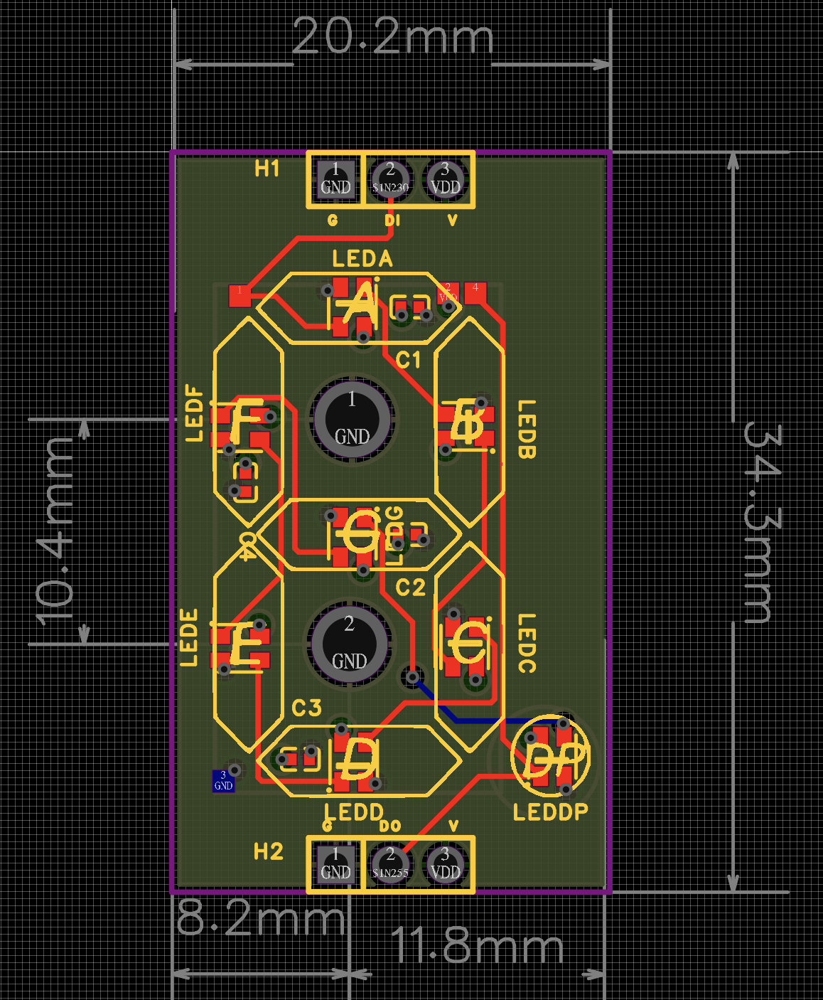
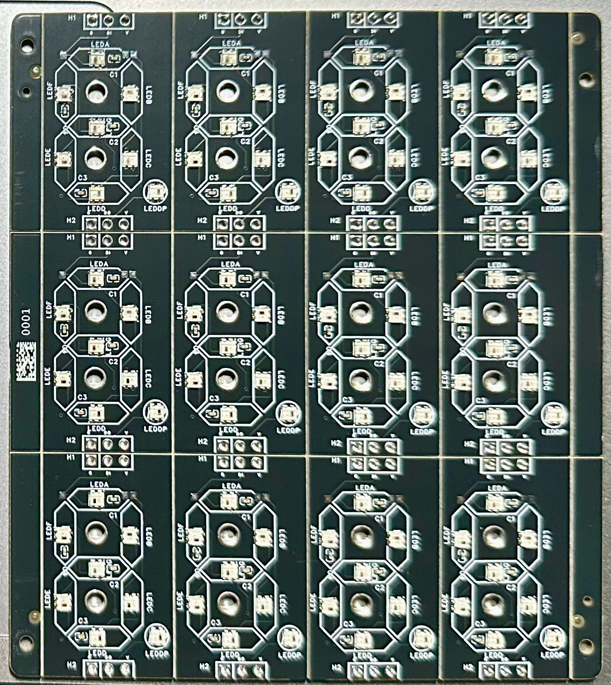
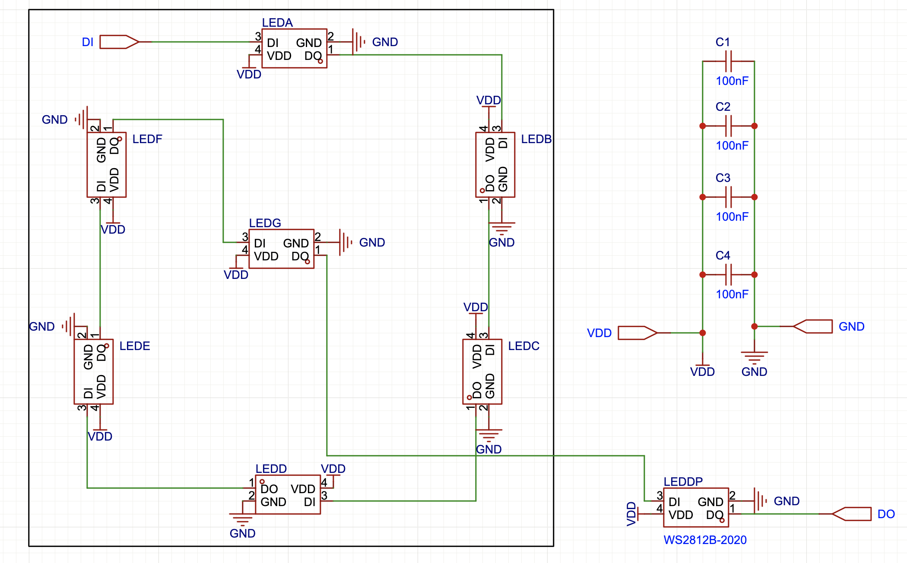

# Mini7Seg

Arduino library for 7-segment displays made from WS2812 / NeoPixel addressable LEDs.

> Build custom seven-segment displays using RGB LEDs instead of traditional single-color LED or LCD displays.


*Demo uses plastic straw halves as diffusers - proper acrylic or 3D-printed diffusers will look much better!*

## Features

- Works with any LED array (FastLED, Adafruit NeoPixel, etc.)
- Single or multiple digits
- Configurable LEDs per segment (1 for tiny displays, 100+ for outdoor signs)
- Spin animations and rainbow effects
- Background modes: overwrite, preserve, or blend
- Displays digits 0-9, hex A-F, letters H J L N O P R U Y, and symbols - _ (space)

## Installation

### Download from GitHub
1. Download this repository as ZIP (Code → Download ZIP)
2. In Arduino IDE: **Sketch → Include Library → Add .ZIP Library**
3. Select the downloaded ZIP file

### Or clone directly
```bash
cd ~/Documents/Arduino/libraries
git clone https://github.com/mcyork/mini7seg.git
```

## Wiring

Each digit uses 8 LEDs wired in segment order: **A, B, C, D, E, F, G, DP**

```
     AAAA
    F    B
    F    B
     GGGG
    E    C
    E    C
     DDDD   DP
```

| LED Index | Segment | Position |
|-----------|---------|----------|
| 0 | A | Top horizontal |
| 1 | B | Upper right vertical |
| 2 | C | Lower right vertical |
| 3 | D | Bottom horizontal |
| 4 | E | Lower left vertical |
| 5 | F | Upper left vertical |
| 6 | G | Middle horizontal |
| 7 | DP | Decimal point |

## Quick Start

```cpp
#include <FastLED.h>
#include "String7Segment.h"

#define DATA_PIN    13
#define NUM_LEDS    8

CRGB leds[NUM_LEDS];
String7Segment display(leds, 0);  // starts at index 0

void setup() {
  FastLED.addLeds<WS2812, DATA_PIN, GRB>(leds, NUM_LEDS);
  FastLED.setBrightness(128);

  display.setForeground(S7Color::Red());
  display.setBackground(S7Color::Black());
}

void loop() {
  for (int i = 0; i <= 9; i++) {
    display.showDigit(i);
    FastLED.show();
    delay(500);
  }
}
```

## API Reference

### Constructors

```cpp
// Single digit, 1 LED per segment
String7Segment(ledArray, offset);

// Multiple digits, 1 LED per segment
String7Segment(ledArray, offset, numDigits);

// Multiple digits, custom LEDs per segment (for large displays)
String7Segment(ledArray, offset, numDigits, ledsPerSegment);
```

### Display Methods

| Method | Description |
|--------|-------------|
| `showDigit(digit, position, showDP)` | Display 0-9 |
| `showChar(char, position, showDP)` | Display character |
| `showNumber(number, leadingZeros)` | Display multi-digit number |
| `showHex(value, digits)` | Display hexadecimal |
| `showSegments(mask, position)` | Display raw segment pattern |
| `clear()` | Clear all digits |
| `clearDigit(position)` | Clear one digit |
| `setDecimalPoint(position, on)` | Control decimal point |

### Animation Methods

| Method | Description |
|--------|-------------|
| `spinStep(step, position)` | Show one frame of spin animation (step 0-5) |
| `getSpinSegment(step)` | Get segment mask for spin step |

### Configuration

| Method | Description |
|--------|-------------|
| `setForeground(color)` | Set lit segment color |
| `setBackground(color)` | Set unlit segment color |
| `setBackgroundMode(mode)` | BG_OVERWRITE, BG_PRESERVE, or BG_BLEND |
| `setLedsPerSegment(count)` | Set LEDs per segment |
| `getLedsPerDigit()` | Returns 8 × ledsPerSegment |

### Colors

```cpp
S7Color::Black()    S7Color::White()
S7Color::Red()      S7Color::Green()    S7Color::Blue()
S7Color::Yellow()   S7Color::Cyan()     S7Color::Magenta()
S7Color::Orange()

// Or custom RGB
S7Color(255, 128, 0)
display.setForeground(128, 0, 255)
```

### Supported Characters

| Type | Characters |
|------|------------|
| Digits | 0 1 2 3 4 5 6 7 8 9 |
| Hex | A B C D E F (a-f also work) |
| Letters | H J L N O P R U Y (case insensitive) |
| Symbols | - (hyphen), _ (underscore), (space) |

## Multi-Digit Wiring

For multiple digits, wire them in sequence:

```
Digit 0: LEDs 0-7
Digit 1: LEDs 8-15
Digit 2: LEDs 16-23
Digit 3: LEDs 24-31
```

```cpp
#define NUM_LEDS 32
CRGB leds[NUM_LEDS];
String7Segment display(leds, 0, 4);  // 4 digits starting at 0

display.showNumber(1234);  // Shows "1234"
```

## Clock Display with Colon

For a clock with a colon between digit pairs, leave a gap in the array for the colon LEDs and create two separate displays:

```
Layout: [HH] : [MM]
LEDs:   0-15  16-17  18-33
```

```cpp
#define NUM_LEDS 34
CRGB leds[NUM_LEDS];

// Two separate 2-digit displays
String7Segment hours(leds, 0, 2);    // LEDs 0-15
String7Segment minutes(leds, 18, 2); // LEDs 18-33

// Colon LEDs managed separately
void setColon(bool on) {
  CRGB color = on ? CRGB::Red : CRGB::Black;
  leds[16] = color;  // Top dot
  leds[17] = color;  // Bottom dot
}

void loop() {
  hours.showNumber(12);
  minutes.showNumber(34);
  setColon(true);
  FastLED.show();
}
```

The library only touches its designated LEDs, so your colon LEDs remain independent.

## Large Outdoor Displays

For displays with multiple LEDs per segment (like LED strip signs):

```cpp
// 50 LEDs per segment = 400 LEDs per digit
#define NUM_LEDS 400
CRGB leds[NUM_LEDS];
String7Segment bigDisplay(leds, 0, 1, 50);
```

Wire all LEDs for segment A first, then B, then C, etc:
```
A0 A1 A2...A49 B0 B1 B2...B49 C0...C49 D0...D49 E0...E49 F0...F49 G0...G49 DP0...DP49
```

## Examples

| Example | Description |
|---------|-------------|
| `basic` | All supported characters |
| `counter` | Simple 0-9 counting |
| `spin` | Various spin animations |
| `rainbow_spin` | Spin with rainbow color cycling |
| `segment_test` | Identify segment wiring |

## Hardware

This library was developed for custom PCBs using WS2812B-2020 LEDs arranged as 7-segment displays.

**PCB Design:** [OSHWLab Project](https://oshwlab.com/mcyork/7-seg-string) - Open source schematic and Gerber files



| PCB Layout | 12-Digit Panel |
|------------|----------------|
|  |  |

Each digit is 20.2mm × 34.3mm with 8 LEDs (WS2812B-2020), decoupling capacitors, and 3-pin headers for daisy-chaining.

<details>
<summary>Schematic</summary>



</details>

## License

MIT License - see [LICENSE](LICENSE) file.
